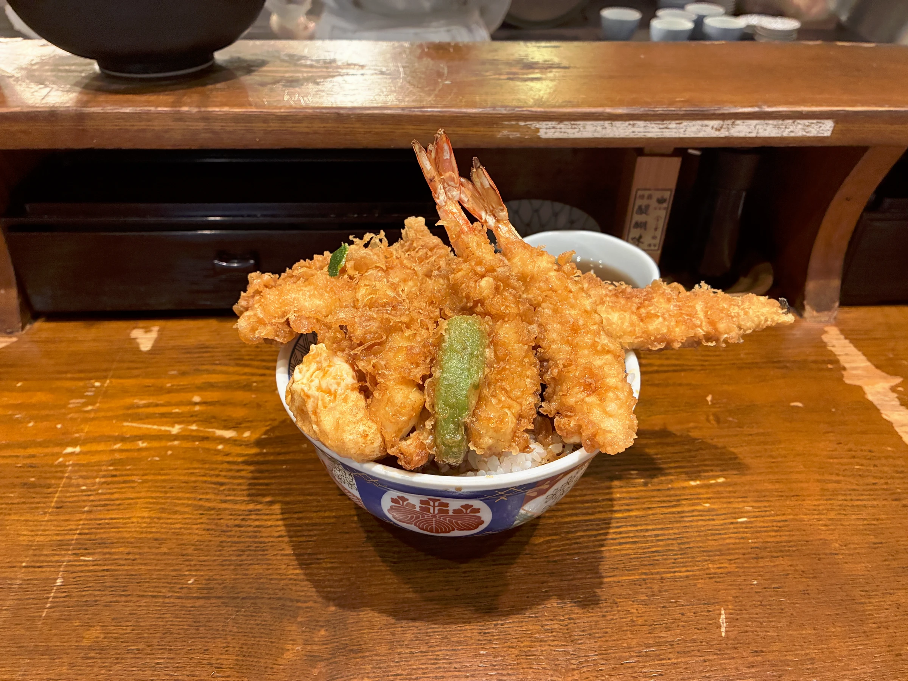

昨年末くらいからあれもこれもやりたくなって、全部やるには長時間活動しなくてはならず、明日も気分よくいるためにまずはちゃんと飯を食べようと思った。夜中に帰ってきた日も深夜料金の松屋で定食を食べた。これを続けると別の問題でまずいと思ってあすけんでざっくりした栄養管理を始めた。それから運動も始めた。健康でいること、話はそこからである。

日本橋で健康診断を受けた。はじめて実費で腸内フローラ検査をつけた。腸内環境からある程度体質がわかるらしく、当たる占いみたいで面白そうだと思った。この日はビルを出たあと上着を羽織りたくなるくらい肌寒い日だった。みんなそうだと思うけど、このときの足取りはさながら孤独のグルメでうまいものを探す。今回は「金子半之助 本店」の天丼を食べた。

めちゃくちゃ美味しかったです。丼いっぱいの天ぷらがぜんぶうまい。はじめに出されるお茶に黒豆が浮かんでいるのも楽しい。

その足で「うさぎや 中央通り店」でどらやきを買いに行く。前にいたスーツのおじさんはおみや用にいくつも買っているみたいだった。軽やかなお会計、こんなひんやりした日に日本橋のどらやきを携えて訪問するような仕事にあこがれる。僕も気分が良かったので配る分も買った。
